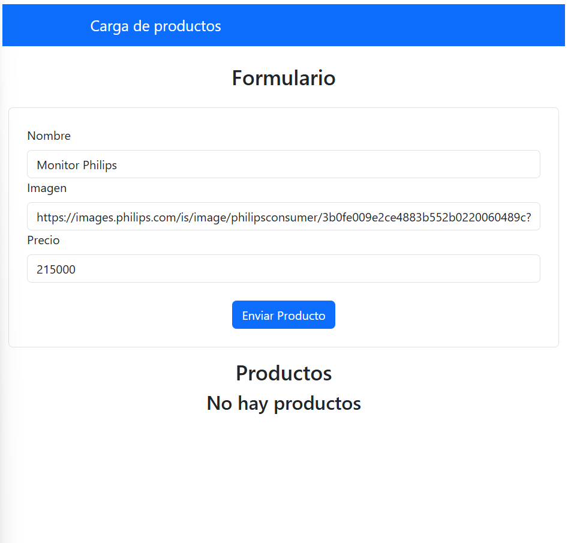
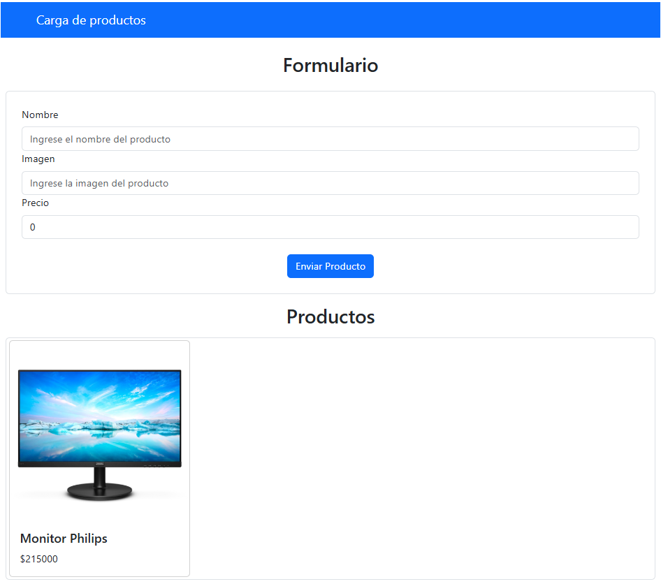

# Trabajo Práctico de React con TypeScript

En este Trabajo Práctico, se desarrollará una aplicación web sencilla utilizando React con TypeScript. La aplicación permitirá a los usuarios cargar productos a través de un formulario y visualizarlos en una lista.


## Autor

- Matías Fernández
- Comisión: 3K10
- Materia: Desarrollo de SoftWare
- Año: 2024

## Características de la aplicación

- Formulario para agregar productos con nombre, imagen y precio.
- Lista de productos que se actualiza dinámicamente.
- Interfaz de usuario construida con React Bootstrap.

## Tecnologías Utilizadas

- **React**: Biblioteca de JavaScript para construir interfaces de usuario.
- **TypeScript**: Lenguaje de programación que añade tipos estáticos a JavaScript.
- **React Bootstrap**: Biblioteca de componentes de interfaz de usuario basada en Bootstrap.


## Pasos de Instalación

1. Clona el repositorio:

```bash
git clone https://github.com/matiFernandezz/TPReactDesarrollo
```
2. Navega al directorio del proyecto:
```bash
cd TpReactDesarrollo
```

3. Instala las dependencias:
```bash
npm install
```

## Modo de Uso 
Para correr la aplicación: 

1. Inicia el servidor de desarrollo escribiendo el siguiente comando:

```bash
npm run dev
```

# Estructura del Proyecto

## Componentes

### **App.tsx**
Componente principal de la aplicación que se encarga de renderizar el componente `AppProduct`.

### **AppProduct.tsx**
Componente encargado de gestionar el estado de los productos. Renderiza tanto el formulario para agregar productos como la lista de productos existentes.

### **Header.tsx**
Componente dedicado a mostrar el encabezado de la aplicación.

### **FormProducts.tsx**
Componente que proporciona el formulario para agregar nuevos productos.

### **ListProducts.tsx**
Componente encargado de renderizar la lista de productos agregados.

## **Hooks**

### **useForm.ts**
Hook personalizado para gestionar el estado y la lógica del formulario.


## Capturas de Pantallas de la aplicación

### Carga del producto


### Producto cargado
